# Practice 1: Discrete Message Source Entropy & Information Estimation

## Objective
The objective of this practice is to master the methodology of quantitative information and entropy estimation for discrete message sources. The project implements analysis tools to profile natural language texts (Ukrainian, German, English) in two states: connected (natural syntax) and unconnected (pseudo-randomly generated text mimicking the language's alphabet) to evaluate language redundancy and structural constraints. Additionally, a dynamic web page scraping component evaluates the entropy of raw web content fetched via HTTP.

---

## Mathematical Model

1. **Symbol Probability Estimation**:
   The probability $p_i$ of occurrence of the $i$-th alphabet symbol in a text of length $N$ is estimated by its relative frequency:
   $$p_i = \frac{n_i}{N}$$
   where $n_i$ represents the frequency count of the symbol.

2. **Shannon Entropy**:
   The average information quantity per symbol (entropy) in bits/symbol is calculated as:
   $$H(X) = -\sum_{i=1}^{m} p_i \log_2(p_i)$$
   where $m$ is the number of unique symbols in the text alphabet.

3. **Total Information Quantity**:
   The total amount of information $I$ in the text of length $N$ is:
   $$I = N \cdot H(X) \quad \text{[bits]}$$
   To express the result in bytes:
   $$I_{\text{bytes}} = \frac{I}{8}$$

---

## Codebase Structure & Components

* **[1.py](1.py)**: Interactive CLI program. Profiles characters in natural texts, computes Shannon entropy, prints frequency statistics, saves results to `results.txt`, and generates comparisons using `matplotlib`.
* **[2.py](2.py)**: Web scraper and analyzer. Fetches web pages using `requests`, cleans HTML content using `beautifulsoup4` (decomposing `<script>` and `<style>` blocks), computes character frequencies and entropy of web pages, and plots the top 30 most frequent characters.
* **[Middleware/random_symbols.py](Middleware/random_symbols.py)**: Generator script that builds pseudo-random character sequences (Variant 3) of length 1500 using defined alphabets to simulate unconnected maximum-entropy texts.
* **[texts.json](texts.json)**: Storage for sample connected texts (Variant 1) and generated unconnected texts (Variant 3) in Ukrainian, German, and English.

---

## Analysis & Visualizations

### 1. Information Amount Comparisons
Below are the comparisons between connected texts (Variant 1) and pseudo-random unconnected text sequences (Variant 3) for different languages. Due to syntax structure, grammar rules, and non-uniform character probabilities, natural connected texts carry significantly less entropy and total information than their unlinked, uniformly distributed equivalents.

| Language | Connected Text vs. Unconnected Noise |
| :--- | :--- |
| **Ukrainian** | 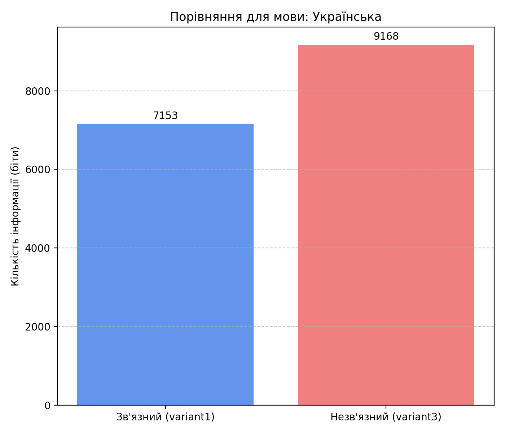 |
| **German** | 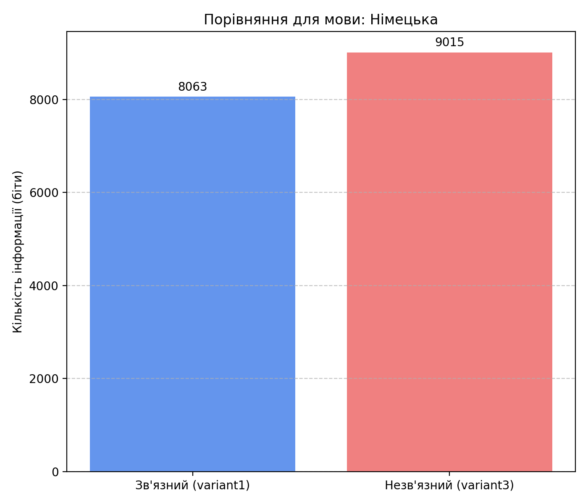 |
| **English** | 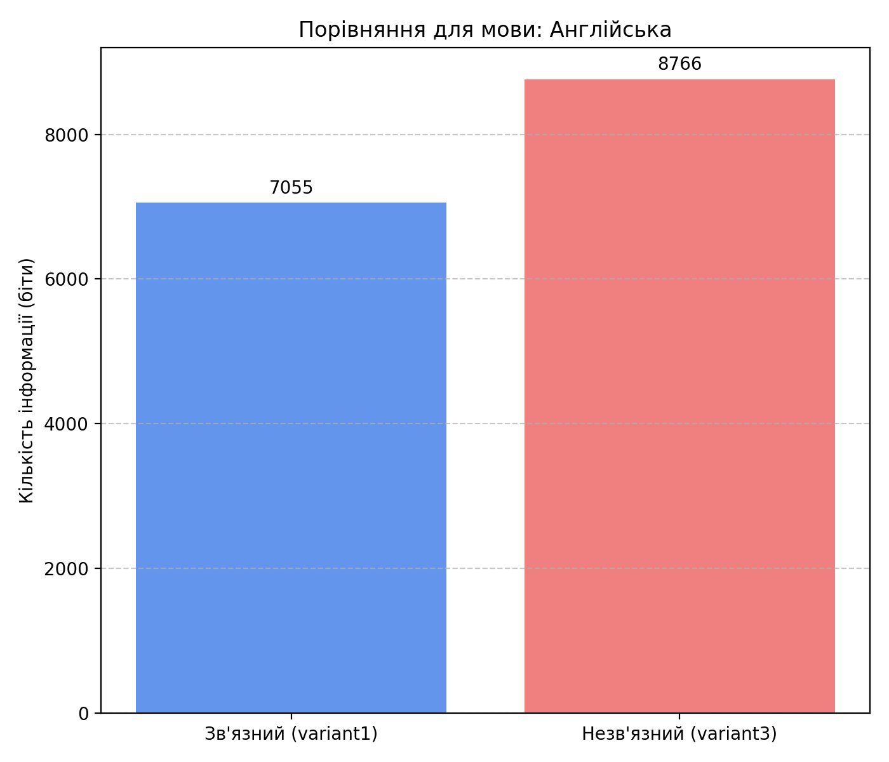 |

#### Overall Comparison Charts
* **Connected Texts (Variant 1)**: Shows lower total information size due to natural linguistic redundancy:
  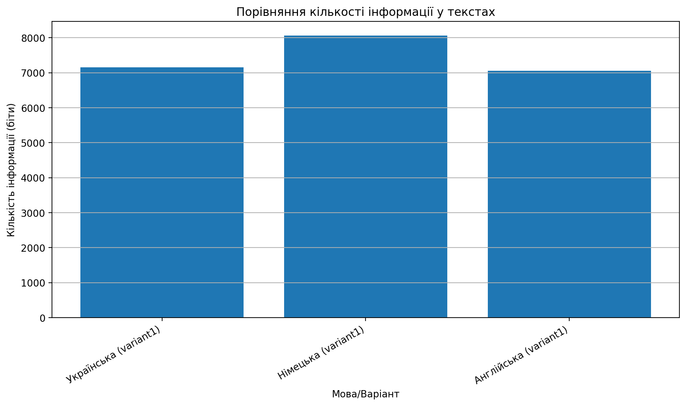
* **Unconnected Noise (Variant 3)**: Shows maximum entropy and higher information quantity per text block:
  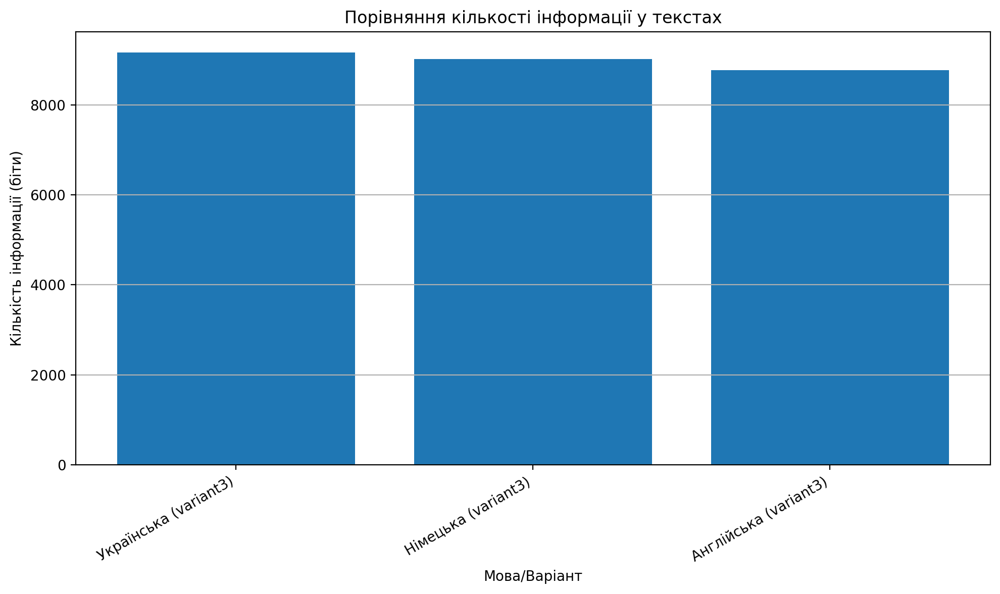

### 2. Character Frequency Distributions

#### Connected Natural Texts (Variant 1)
Natural language texts exhibit highly skewed character distributions (e.g., vowels and spaces are extremely frequent, while symbols like 'ґ' or 'ß' are rare):
* **Ukrainian**: 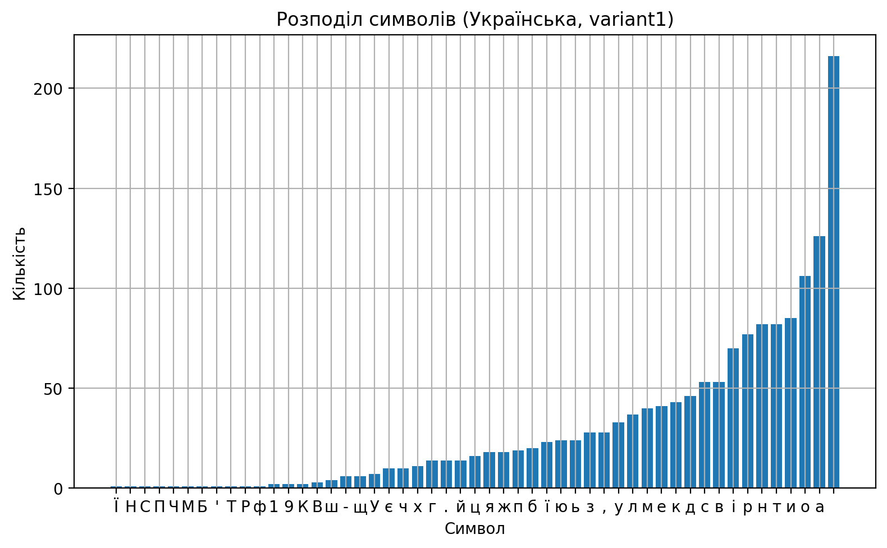
* **German**: 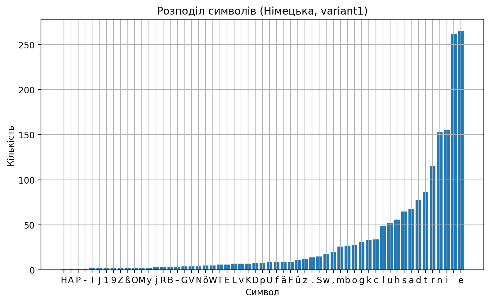
* **English**: 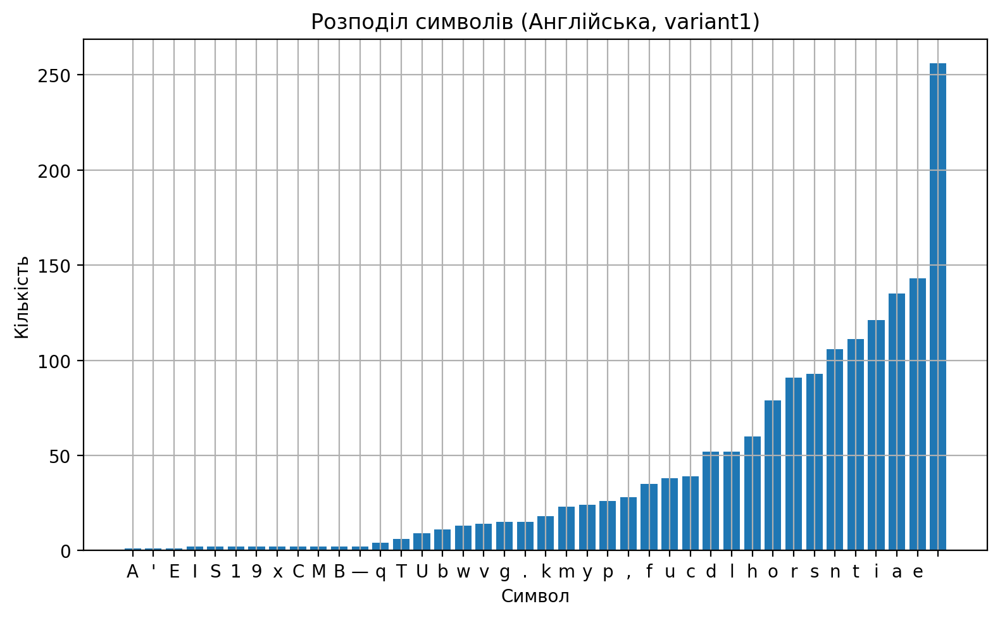

#### Unconnected Generated Texts (Variant 3)
Pseudo-random character generation creates a near-uniform distribution of characters, which approaches the theoretical maximum entropy:
* **Ukrainian**: 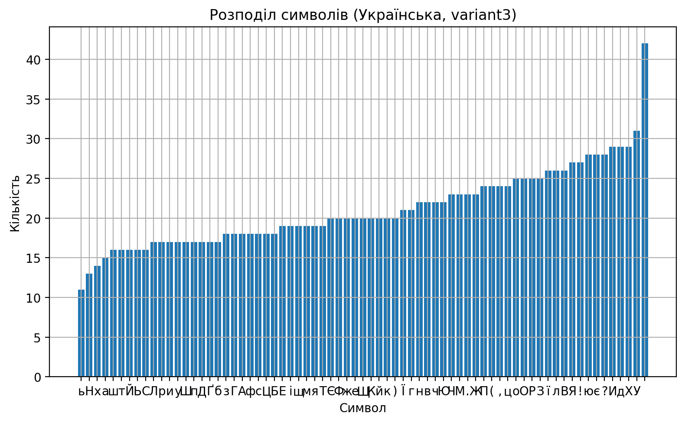
* **German**: 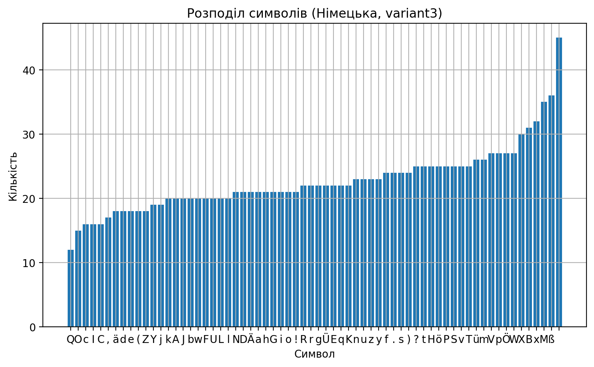
* **English**: 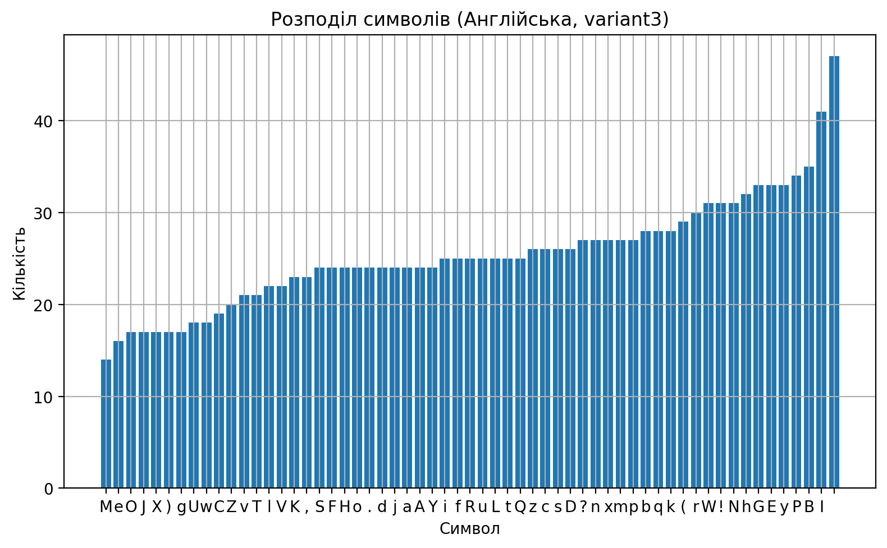

---


## How to Run

1. Install dependencies:
   ```bash
   pip install -r ../requirements.txt
   ```
2. To analyze local texts:
   ```bash
   python 1.py
   ```
3. To analyze any website:
   ```bash
   python 2.py
   ```
