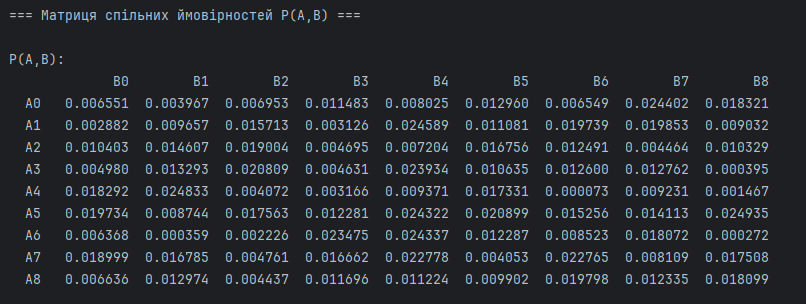
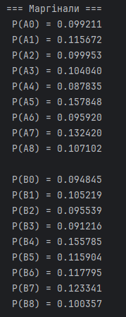
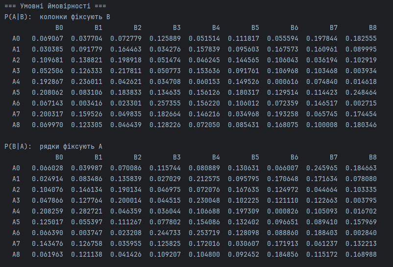
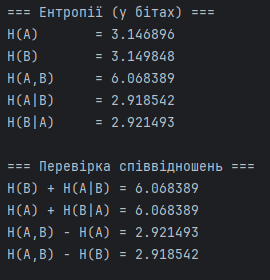

# Practice 2: Joint & Conditional Entropy Analysis of Sources with Memory

## Objective
The objective of this practice is to master the concepts of conditional and joint entropy, and to verify the fundamental mathematical relations that govern discrete information sources with memory (i.e., where the probability of a symbol depends on the preceding symbols). The project constructs a joint probability space for two dependent variables $A$ and $B$, calculates all marginal and conditional probability distributions, and validates Shannon's entropy chain rules.

---

## Mathematical Model

1. **Joint Probability Matrix**:
   For two random variables $A = \{a_1, \dots, a_9\}$ and $B = \{b_1, \dots, b_9\}$, the joint probability matrix $P(A, B)$ maps the probability of simultaneous occurrences. The elements must satisfy:
   $$\sum_{i=1}^{9} \sum_{j=1}^{9} p(a_i, b_j) = 1$$

2. **Marginal (Unconditional) Probabilities**:
   Obtained by summing the joint probabilities across rows (for $A$) and columns (for $B$):
   $$p(a_i) = \sum_{j=1}^{9} p(a_i, b_j) \quad \text{and} \quad p(b_j) = \sum_{i=1}^{9} p(a_i, b_j)$$

3. **Conditional Probabilities**:
   Determine the probability of one event given the occurrence of another:
   $$p(a_i \mid b_j) = \frac{p(a_i, b_j)}{p(b_j)} \quad \text{and} \quad p(b_j \mid a_i) = \frac{p(a_i, b_j)}{p(a_i)}$$

4. **Entropies**:
   * **Unconditional Entropies**:
     $$H(A) = -\sum_{i=1}^{9} p(a_i) \log_2 p(a_i) \quad \text{and} \quad H(B) = -\sum_{j=1}^{9} p(b_j) \log_2 p(b_j)$$
   * **Joint Entropy**:
     $$H(A, B) = -\sum_{i=1}^{9} \sum_{j=1}^{9} p(a_i, b_j) \log_2 p(a_i, b_j)$$
   * **Conditional Entropies**:
     $$H(A \mid B) = -\sum_{i=1}^{9} \sum_{j=1}^{9} p(a_i, b_j) \log_2 p(a_i \mid b_j)$$
     $$H(B \mid A) = -\sum_{i=1}^{9} \sum_{j=1}^{9} p(a_i, b_j) \log_2 p(b_j \mid a_i)$$

5. **Chain Rules & Identities to Verify**:
   * $$H(A, B) = H(A) + H(B \mid A) = H(B) + H(A \mid B)$$
   * $$H(B \mid A) = H(A, B) - H(A)$$
   * $$H(A \mid B) = H(A, B) - H(B)$$

---

## Codebase Structure & Components

* **[1.py](1.py)**: Python script implementing matrix operations with `numpy`. It:
  * Generates a random $9 \times 9$ matrix and normalizes it to obtain $P(A, B)$.
  * Computes the marginal and conditional matrices.
  * Calculates $H(A)$, $H(B)$, $H(A, B)$, $H(A \mid B)$, and $H(B \mid A)$.
  * Uses a small constant $\epsilon = 10^{-12}$ to avoid log-zero division errors.
  * Outputs the results and verifies the relationships.

---

## Program Output & Verification

The program prints the calculated matrices and verifies the identities:

1. **Joint Probability Matrix $P(A, B)$**:
   

2. **Marginal Distributions $P(A)$ and $P(B)$**:
   * Rows sum ($P(A)$) and columns sum ($P(B)$):
   
     | $P(A)$ | $P(B)$ |
     | :---: | :---: |
     |  |  |

3. **Conditional Probabilities $P(A \mid B)$ and $P(B \mid A)$**:
   

4. **Entropies and Analytical Verification**:
   The execution console demonstrates that the conditional entropies are strictly less than the unconditional entropies ($H(A \mid B) < H(A)$ and $H(B \mid A) < H(B)$), confirming that memory/statistical dependency reduces the uncertainty of the system.
   
   Furthermore, all chain rules are validated to six decimal places:
   

---

## How to Run

1. Run the Python analysis:
   ```bash
   python 1.py
   ```
