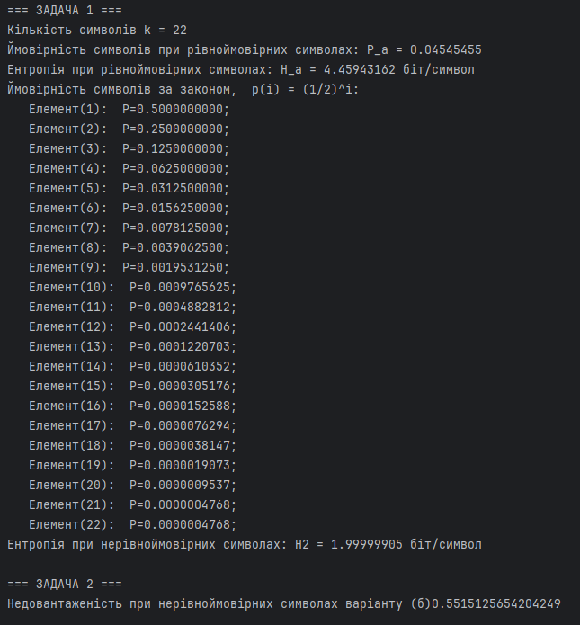
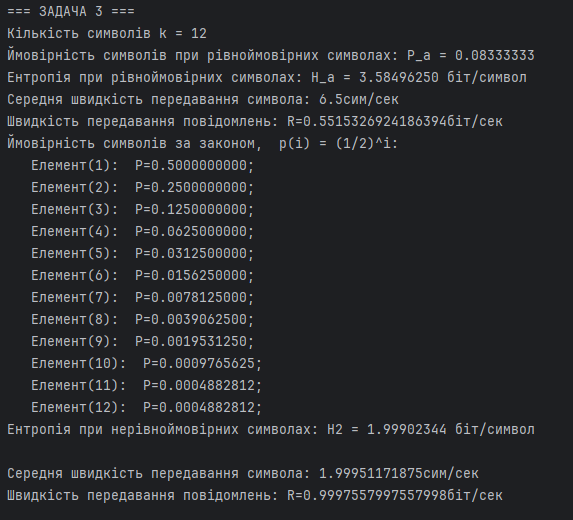
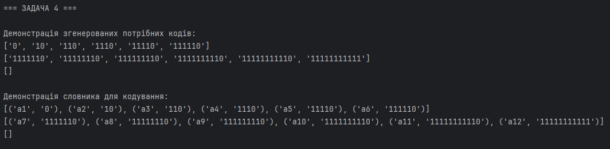

# Practice 3: Transmission Speed & Shannon-Fano Coding

## Objective
The objective of this practice is to evaluate the transmission speed and source under-utilization (linguistic redundancy) of discrete message sources, and to implement the **Shannon-Fano optimal prefix coding algorithm** to compress messages by assigning shorter code words to more frequent symbols.

---

## Mathematical Model

### 1. Entropy of Uniform vs. Non-Uniform Sources
* **Uniform (Equiprobable) Source**:
  If all $k$ symbols in the alphabet have equal probability ($p_i = 1/k$), the entropy is maximized:
  $$H_{\text{max}} = \log_2(k) \quad \text{[bits/symbol]}$$
* **Non-Uniform Source**:
  If symbols follow a decaying probability law $p_i = 2^{-i}$ (with the last symbol adjusted to ensure $\sum p_i = 1$), Shannon entropy is calculated as:
  $$H = -\sum_{i=1}^{k} p_i \log_2(p_i) \quad \text{[bits/symbol]}$$

### 2. Source Under-utilization (Redundancy)
Redundancy $R$ indicates the fraction of the channel capacity wasted due to non-uniform distributions:
$$R = 1 - \frac{H}{H_{\text{max}}}$$

### 3. Message Transmission Speed
If transmitting symbol $a_i$ takes $\tau_i$ seconds, the average duration $T_{\text{avg}}$ of a symbol is:
$$T_{\text{avg}} = \sum_{i=1}^{k} p_i \tau_i \quad \text{[seconds/symbol]}$$
The transmission speed $V$ in bits/second represents the rate of information flow:
$$V = \frac{H}{T_{\text{avg}}} \quad \text{[bits/second]}$$

### 4. Shannon-Fano Coding Algorithm
An optimal prefix code must satisfy the prefix property (no code word is a prefix of another), enabling instantaneous decoding.
* **Algorithm Steps**:
  1. Sort alphabet symbols by probability descending.
  2. Split the list into two parts such that the sum of probabilities in the top part is as close as possible to the sum of the bottom part.
  3. Assign binary `0` to the top part and `1` to the bottom part.
  4. Recursively repeat the splitting for both parts until each subgroup contains only one symbol.
* **Goal**: Minimize the average code word length:
  $$L_{\text{avg}} = \sum_{i=1}^{k} p_i l_i \rightarrow \min$$
  where $l_i$ is the length of the binary code word for the $i$-th symbol.

---

## Codebase Structure & Components

* **[1.py](1.py)**: Python script solving four tasks:
  * **Task 1 & 2**: Computes entropy and redundancy for an alphabet size of $k = 22$ under uniform and decaying probability laws.
  * **Task 3**: Calculates $T_{\text{avg}}$ and transmission speed $V$ for a source of $k = 12$ symbols where transmission times are proportional to symbol indices ($\tau_i = i$ seconds).
  * **Task 4**: Implements the recursive `shannon_fano` tree builder, generates a code book, and shows the coding/decoding dictionary.

---

## Program Output & Verification

1. **Task 1 & 2: Entropy and Redundancy ($k=22$)**:
   The entropy of the uniform source is $H_{\text{max}} \approx 4.459$ bits/symbol. For the decaying probability source, $H \approx 2.0$ bits/symbol, leading to a massive under-utilization coefficient $R \approx 0.55$ (55% redundancy).
   

2. **Task 3: Average Time & Speed ($k=12$)**:
   Demonstrates that although the non-uniform source has lower entropy, because the most frequent symbols are assigned the shortest transmission times ($\tau_1 = 1$, $\tau_2 = 2$ etc.), its average symbol duration is very small ($T_{\text{avg}} \approx 2$ sec). This yields a transmission speed ($V \approx 1$ bit/sec) almost twice as fast as the uniform source ($V \approx 0.55$ bit/sec).
   

3. **Task 4: Optimal Shannon-Fano Codes**:
   The generated code book shows that the most frequent symbol $a_1$ ($p=50\%$) receives the code `0` (length 1), while rare symbols receive longer codes (up to 12 bits), minimizing the average code length.
   

---

## How to Run

1. Run the Python execution:
   ```bash
   python 1.py
   ```
