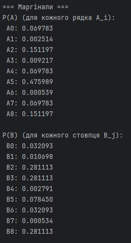
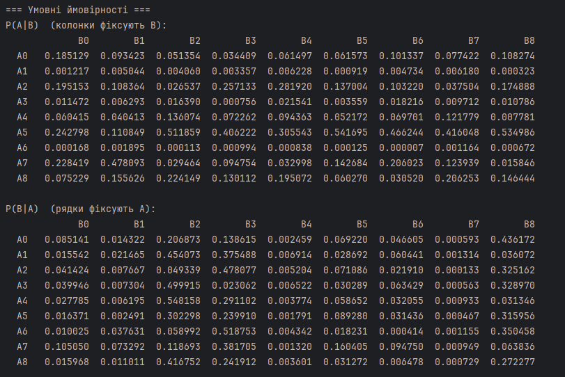
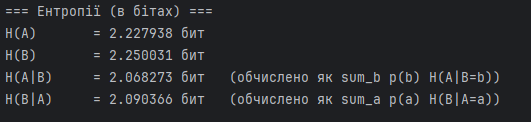
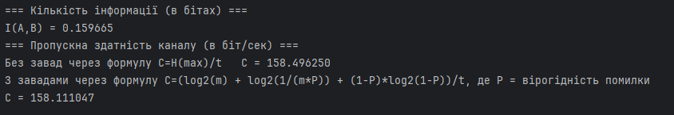

# Practice 4: Channel Capacity & Information Losses in Noisy Channels

## Objective
The objective of this practice is to model a discrete noisy communication channel, evaluate the quantitative information loss (conditional entropy $H(A \mid B)$) caused by channel noise, compute the mutual information successfully transmitted, and calculate the channel capacity for both ideal (noiseless) and noisy symmetric channels.

---

## Mathematical Model

1. **Marginal Distributions**:
   The input $P(A)$ and output $P(B)$ alphabet probability distributions are generated using a binomial distribution law:
   $$p(a_i) = \binom{n}{k_i} p^{k_i} (1-p)^{n-k_i}$$
   normalized to ensure their sum equals 1. Here, $m=9$ is the alphabet size.

2. **Joint Probability Matrix Construction**:
   The joint matrix $P(A, B)$ matching the $P(A)$ and $P(B)$ marginals is solved iteratively using the **Sinkhorn-Knopp / Iterative Proportional Fitting (IPF)** algorithm:
   $$p^{(k)}(a_i, b_j) = p^{(k-1)}(a_i, b_j) \cdot \frac{p(a_i)}{\sum_j p^{(k-1)}(a_i, b_j)}$$
   alternating rows and columns normalization until convergence.

3. **Mutual Information (Successfully Transmitted Information)**:
   The amount of information that safely traverses the noisy channel is:
   $$I(A, B) = H(A) - H(A \mid B)$$
   where $H(A \mid B)$ is the conditional entropy (information loss / noise equivocation):
   $$H(A \mid B) = -\sum_{i=1}^{m} \sum_{j=1}^{m} p(a_i, b_j) \log_2 p(a_i \mid b_j)$$

4. **Channel Capacity**:
   * **Ideal (Noiseless) Channel**:
     $$C = \frac{\log_2(m)}{t} \quad \text{[bits/second]}$$
     where $t$ is the transmission duration per symbol ($t = 0.02$ sec).
   * **Symmetric Channel with Noise**:
     $$C = \frac{\log_2(m) + p_e \log_2\left(\frac{p_e}{m-1}\right) + (1-p_e)\log_2(1-p_e)}{t} \quad \text{[bits/second]}$$
     where $p_e$ is the transition error probability ($p_e = 0.0005$).

---

## Codebase Structure & Components

* **[1.py](1.py)**: Python program utilizing `numpy` and `scipy.stats.binom`. It:
  * Generates $P(A)$ and $P(B)$ using binomial distributions.
  * Constructs the joint matrix $P(A, B)$ using IPF.
  * Calculates conditional distributions, unconditional/conditional entropies, and mutual information.
  * Evaluates channel capacity limits with and without noise.

---

## Program Output & Verification

1. **Marginals & State Distributions**:
   Shows binomial probability curves for input $P(A)$ and output $P(B)$ alphabets:
   

2. **Conditional Probabilities (Channel Noise Model)**:
   The умовні ймовірності $P(A \mid B)$ and $P(B \mid A)$ show how the transmitted symbols are "dispersed" across multiple possible output states, representing the impact of noise:
   

3. **Entropy & Mutual Information**:
   Shows that because the channel is highly noisy, the conditional entropy (loss) $H(A \mid B) \approx 2.068$ bits is very close to the source entropy $H(A) \approx 2.228$ bits, meaning that only a small fraction of information ($I(A,B) \approx 0.16$ bits) is successfully transmitted:
   

4. **Channel Capacity Limits**:
   Calculates the maximum possible transmission rates:
   * **Noiseless Capacity**: $C \approx 158.50$ bits/sec
   * **Noisy Symmetric Capacity** ($p_e = 0.0005$): $C \approx 158.11$ bits/sec
   

---

## How to Run

1. Run the script:
   ```bash
   python 1.py
   ```
